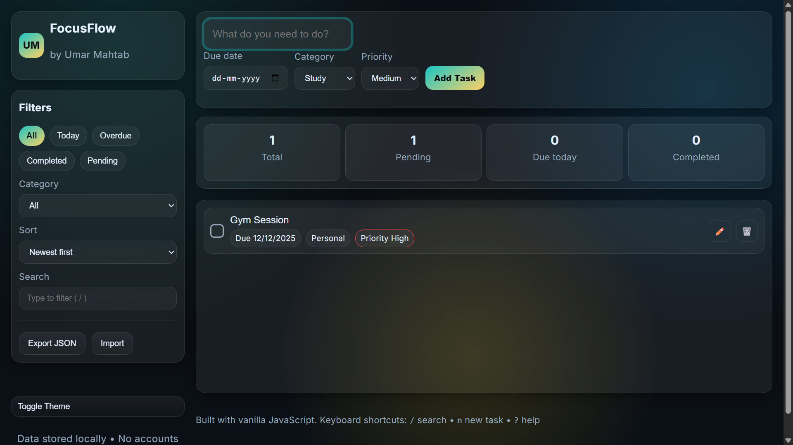

# FocusFlow — Vanilla JS Productivity App

A clean, fast **to‑do app** built with **HTML + CSS + JavaScript** (no frameworks). Perfect as a student project to show JavaScript skills.

## Screenshots


## Features
- Add tasks with **title + due date + category + priority**
- Mark complete/incomplete, inline edit, delete
- **Search**, **filter**, **sort**
- **Stats** (total, pending, due today, completed)
- **Drag and drop** to reorder
- **Dark/Light** theme (saved in `localStorage`)
- Import/Export tasks as JSON
- No backend — data saved locally in the browser

## Run
Just open `index.html` in your browser (double click). No build step, no dependencies.

## File Structure
```
index.html
style.css
script.js
```

## License
MIT — do anything, just keep the copyright.
